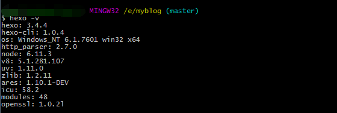

# First say Hello World
通常惯例，我们学习的大部分程序语言基本上第一个程序都是`Hello World`。
```
echo 'Hello World!'
```

# How to build your Hexo
部署`Hexo`作为个人博客，可以参考的资料很多很多，推荐的是hexo的[官方文档](https://hexo.io/docs/),里面有详尽的说明；建议有geek精神的小伙伴们多多参考官方文档学习。
如果觉得阅读官方文档太繁琐，只想按照规则quick start的话，可以继续阅读本文档；

## Prepare work
抛开待安装的操作系统，安装配置hexo前需要准备环境如下：
> 1. Nodejs
> 2. Git

这两个基本环境的配置安装，如果有不熟悉的小伙伴，自行科学上网安装，主要说下这两个在部署Hexo中的作用：hexo的安装，以及后期运行过程中均需要nodejs的支持；git的主要用途是管理我们创建的hexo的网站文件。

## Install hexo-cli
完成安装nodejs和git后，Terminal终端运行 `npm install -g hexo-cli` 安装Hexo；安装完成后，Terminal运行命令 `hexo -v` 出现如下界面，即表示Hexo安装成功:

## Init blog directory
成功完成hexo的cli安装后，需要在terminal执行 `hexo init myblog` 命令初始化我们的博客位置，示例中我们初始化的博客的位置为${ROOT_DIR}/myblog，执行完命令后，在myblog文件夹下我们会有如下内容：
```
.
├── _config.yml
├── package.json
├── scaffolds
├── source
|   ├── _drafts
|   └── _posts
└── themes
```
具备上述内容说明hexo博客我们离成功安装就差一步了，若需要博客能够正常运行，需要在terminal进入到mybolg文件夹下，执行`npm install`即可安装hexo博客运行所需要的所有的依赖，执行完后myblog目录下会多出一个*node_modules*,具体的文件结构如下：
```
.
├── node_modules
├── _config.yml
├── package.json
├── scaffolds
├── source
|   ├── _drafts
|   └── _posts
└── themes
```
## Config hexo

## Themes management
上述方式安装的hexo默认使用的是landspace的主题，有的小伙伴可能觉得主题太丑，想更换主题,操作也很简单，本文以当前Star数量最多的NexT主题的安装来说明Hexo的主题管理。
### clone 主题至指定目录
在Terminal终端执行如下命令将Next主题拷贝至 ${MY_BLOG_DIR}/themes/next目录下：
```
git clone git@github.com:theme-next/hexo-theme-next.git ${MY_BLOG_DIR}/themes/next
```
### 修改myblog根目录下配置
修改${MY_BLOG_DIR}/_config.yml文件的内容：
```
# Extensions
## Plugins: https://hexo.io/plugins/
## Themes: https://hexo.io/themes/
### theme: landscape # 默认的主题
theme: next ##新安装的主题，对应的目录位置为 ./themes/next
```

修改完当前配置后，terminal运行命令`hexo server`重启hexo,本地调试后即成功替换主题为NexT。使用上述步骤完成Hexo主题更换后发现并不是我们目前博客所使用的主题，原因是因为在主题文件目录${MY_BLOG_DIR}/themes/next下的__config.yml_中的schemes，需要进行修改，修改成如下格式即可：
```
# ---------------------------------------------------------------
# Scheme Settings
# ---------------------------------------------------------------

# Schemes
#scheme: Muse
scheme: Mist
#scheme: Pisces
#scheme: Gemini
```
### 文章显示摘要设置
使用NexT主题后，发现所有的博客文章都是全文显示的，可不可每个文章只显示一句话或者固定长度的文字（即缩略），答案是显示固定长度文字是可以的，在主题文件目录${MY_BLOG_DIR}/themes/next下的__config.yml_修改`auto_excerpt`即可：
```
# Automatically Excerpt. Not recommend.
# Please use <!-- more --> in the post to control excerpt accurately.
auto_excerpt:
  enable: true  # 将默认的false改为true
  length: 150   # 根据需要决定显示的字数，这里没有修改，默认150字
```

### Nav 设置
使用NexT主题后，默认导航栏，有两个，主页和归档。我们会按照自己的需求添加相应的导航栏，自定义导航栏需要修改主题文件目录${MY_BLOG_DIR}/themes/next下的__config.yml_中的`menu`：
```
# When running the site in a subdirectory (e.g. domain.tld/blog), remove the leading slash from link value (/archives -> archives).
# Usage: `Key: /link/ || icon`
# Key is the name of menu item. If translate for this menu will find in languages - this translate will be loaded; if not - Key name will be used. Key is case-senstive.
# Value before `||` delimeter is the target link.
# Value after `||` delimeter is the name of FontAwesome icon. If icon (with or without delimeter) is not specified, question icon will be loaded.
menu:
  home: / || home
  categories: /categories || th
  archives: /archives || archive
  tags: /tags || tags
  about: about || user
  #home: / || home
  #about: /about/ || user
  #tags: /tags/ || tags
  #categories: /categories/ || th
  #archives: /archives/ || archive
  #schedule: /schedule/ || calendar
```
如上述代码，我们实现了导航栏中`首页|分类|标签|归档|关于`这五个按钮，完成配置文件的修改后需要在${MY_BLOG_DIR}/source/文件夹下创建 categories，tags，about文件夹， 并且在每个文件夹下创建 index.md文件，文件内容如下:
```
---
title: 分类
date: 2018-01-03 17:34:24
type: "categories"
---

```
重启hexo后即可实现导航栏的成功添加。在解决menu这个问题时曾经发现几个坑，不注意的时候可能会踩到坑，希望记录下来和大家多多交流：
> 1. 导航栏可以成功显示配置的英文字母，但没有图标与之对应，发现这个问题后参考了默认的menu的配置，发现问题是 `home: / || home` 中的|| 和之后的内容没有加上导致的，通过这个可以判断出 `|| home`这个是导航栏图标的配置，需要根据自己的需求选择；
> 2. 语言问题，导航栏配置成功后发现语言一支不对，自己乱鼓捣了一遍，最后是修改 ${MY_BLOG_DIR}/_config.yml 中的 `language: zh-Hans` 搞定的，具体是不是这里还需要在确定一下

## RSS

# Reference
[20分钟教你使用hexo搭建github博客](https://www.jianshu.com/p/e99ed60390a8)
[Hexo官方文档](https://hexo.io/zh-cn/docs/)
[Hexo博客个性化及NexT主题配置](https://www.jianshu.com/p/d737c7fff867)
[Hexo 主题设置](https://www.jianshu.com/p/1fb65c61fa4a)
[hexo生成博文插入图片](http://blog.csdn.net/sugar_rainbow/article/details/57415705)

