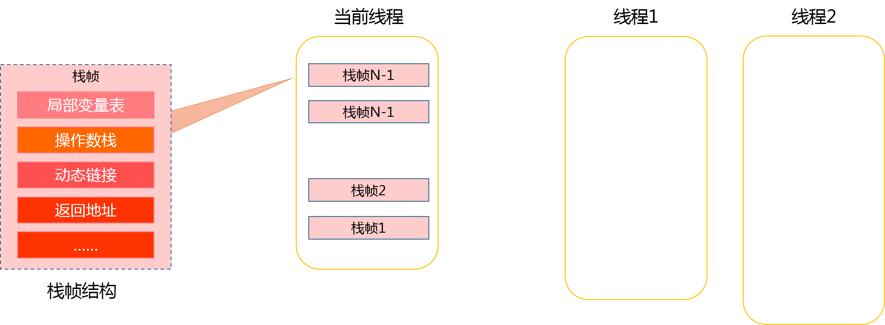

### 简介
JVM(Java Virtual Machine,Java虚拟机）对于目前从事java开发的每一个程序员来说，似乎是永远躲不掉的坎儿：Web应用程序运行变慢了，身边肯定会有人说你看下gc，看看是不是gc导致程序运行变慢的；面试中看到你写了懂JVM，面试官也会揪着这个死缠乱打；了解SolrCloud、Elasticsearch这类基于lucene的开源搜索组件时，了解JVM会对这些系统的调优有很大的帮助。了解JVM，去阅读一手的英文doc肯定是最佳的方式，除了官方doc，关于jvm的博客在搜索引擎上也大把大把的存在。但中文博客的前篇一律，让我们在提取真正需要的信息时会有界限。我们想结合现在中文博客、《深入了解Java虚拟机》以及官方doc，在未来的一系列文章中，由浅入深，解密jvm中的原理。

### JVM组成
了解java虚拟机，首先需要了解下JVM虚拟机所管理的内存的构成：程序计数器、本地方法栈、栈、JAVA堆、方法区。

**程序计数器**：程序计数器是一块较小的内存空间，可以看做是当前线程所执行的字节码的行号指示器，程序的分支、循环、跳转、异常处理、线程恢复等基础功能都需要程序计数器完成；
**虚拟机栈**：生命周期与线程相同，虚拟机栈描述的是Java方法执行的内存模型--每个方法在执行的同时都会创建一个栈帧，用于存储局部变量表、操作数栈、动态链接、方法出口等信息。
> 这里对于虚拟机栈进一步说明一下：
> 1. 局部变量表： 局部变量表是一组变量值存储空间，用于存放方法参数和方法内部定义的局部变量。在Java程序被编译成Class文件时，就在方法的Code属性的max_locals数据项中确定了该方法所需要分配的最大局部变量表的容量。
虚拟机栈帧中，局部变量表中变量的作用域是当前调用的函数，如果被调用函数的局部变量越多，会使局部变量表膨胀，因此导致函数调用会占用更多的栈空间，如果此时栈空间设置的过少，会抛出StackOverFlow异常。
>
> 2. 操作数栈：Java虚拟机的解释执行引擎被称为“基于栈的执行引擎”，其中的栈主要指的就是操作数栈（也叫操作栈）。和局部变量区一样，操作数栈也是被组织成一个以字长为单位的数组。但是和前者不同的是，它不是通过索引来访问，而是通过标准的栈操作压栈/出栈来访问的。比如，如果某个指令把一个值压入到操作数栈中，稍后另一个指令就可以弹出这个值来使用。
> 
> 3. 活动线程中，只有栈顶的栈帧是有效的，称为当前栈帧，这个栈帧所关联的方法称为当前方法。执行引擎所运行的所有字节码指令都只针对当前栈帧进行操作。

**本地方法栈**：本地方法栈则为虚拟机使用到的Native方法提供内存空间，而虚拟机栈为Java方法提供内存空间。
**Java堆**：Java堆是Java虚拟机管理的最大的一块内存，Java程序中创建的所有对象实例几乎都存储在Java堆中，因此Java堆也是jvm进行垃圾回收（GC）的主要战场。java堆根据对象在堆中存活的时间长短，又将堆内存分为新生代和老年代。
**方法区**：用于存储已被虚拟机加载的类信息，常量，静态变量等。运行时常量池也方法区的一部分，用于存放编译期生成的各种字面量和符号引用。

以上五部分构成的Java虚拟机的内存结构的划分，接下来我们会更深入的了解每一部分的主要作用。

### 内存区域详解
#### 程序计数器（PC)
PC指当前指令（或操作码）的地址，本地指令除外。如果当前方法是 native 方法，那么 PC 的值为 undefined。所有的 CPU 都有一个 PC，典型状态下，每执行一条指令 PC 都会自增，因此 PC 存储了指向下一条要被执行的指令地址。JVM 用 PC 来跟踪指令执行的位置，PC 将实际上是指向方法区（Method Area）的一个内存地址。

#### 虚拟机栈(Virtual Machine Stack)
虚拟机栈中主要保存的是程程序执行时的栈帧，栈帧(Stack Frame)是用于支持虚拟机进行方法调用和方法执行的数据结构，它是虚拟机运行时数据区的虚拟机栈的栈元素。栈帧存储了方法的局部变量表，操作数栈，动态连接和方法返回地址等信息。第一个方法从调用开始到执行完成，就对应着一个栈帧在虚拟机栈中从入栈到出栈的过程。
一个线程中的方法调用链可能会很长，很多方法都同时处理执行状态。对于执行引擎来讲，活动线程中，只有虚拟机栈顶的栈帧才是有效的，称为当前栈帧(Current Stack Frame)，这个栈帧所关联的方法称为当前方法(Current Method)。执行引用所运行的所有字节码指令都只针对当前栈帧进行操作。栈帧的概念结构如下图所示：

1. 局部变量表

2. 操作数栈

3. 动态链接
每个栈帧都包含一个指向运行时常量池中该栈帧所属性方法的引用，持有这个引用是为了支持方法调用过程中的动态连接。在Class文件的常量池中存有大量的符号引用，字节码中的方法调用指令就以常量池中指向方法的符号引用为参数。这些符号引用一部分会在类加载阶段或第一次使用的时候转化为直接引用，这种转化称为静态解析。另外一部分将在每一次的运行期期间转化为直接引用，这部分称为动态连接。

4. 方法返回地址

#### 本地方法栈

#### Java堆

#### 方法区

以上就是我们对于Java虚拟机的初步了解，关于JVM垃圾回收，类加载机制等内容会在后续的文章中逐步解析。

> 由于个人知识有限，在总结博客的过程中难免对有些内容了解的不够透彻而造成知识点的错误，希望您能指出文章中表述有误的地方，帮助我和阅读到博客的各位，增进对Java虚拟机的理解。

### Reference
1. 《深入理解Java虚拟机》
2. [JVM内幕：Java虚拟机详解](http://www.importnew.com/17770.html)
3. [Java中的局部变量表及使用jclasslib进行查看](https://blog.csdn.net/u010570551/article/details/55684661)
4. [java虚拟机 jvm 方法区实战](https://blog.csdn.net/qq_30739519/article/details/51048870)