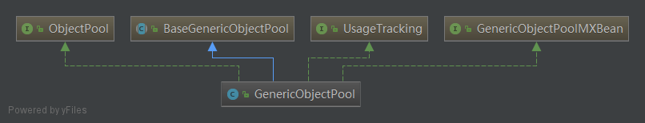
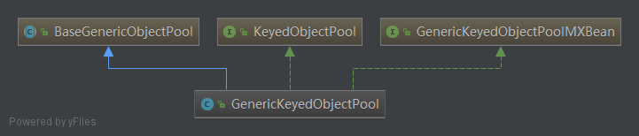

使用Spring开发web应用时，我们经常会使用到数据库链接的工具，通常我们使用最多的是`druid` 这个作为连接数据库的sdk，druid是阿里巴巴团队基于连接池的技术对jdbc连接进行了封装，在研读了jedis的池化连接客户端后，打算在如何基于Apache commons-pool2实现池化连接客户端上进行简要的解读，方便爱动手的geek们封装自己的池化连接客户端。

## commons-pool2
构建池化连接的客户端，需要我们在maven工程引入Apache commons-pool的pom依赖(gradle,ant工程请参照各自的依赖管理引入依赖):

```
<dependency>
    <groupId>org.apache.commons</groupId>
    <artifactId>commons-pool2</artifactId>
    <version>2.4.2</version>
</dependency>
```

在commons-pool2定义了几个对象池接口和基类，我们在创建新的对象池的时候可以参考：

### PooledObjectFactory 池化工厂对象

```
package org.apache.commons.pool2;

public interface PooledObjectFactory<T> {
    
    /**
     * 创建对象
     */
    PooledObject<T> makeObject() throws Exception;

    void destroyObject(PooledObject<T> var1) throws Exception;

    boolean validateObject(PooledObject<T> var1);

    void activateObject(PooledObject<T> var1) throws Exception;

    void passivateObject(PooledObject<T> var1) throws Exception;
}
```

### ObjectPool 和 KeyObjectPool 提供所有对象的存取管理

```
package org.apache.commons.pool2;

import java.util.NoSuchElementException;

public interface ObjectPool<T> {
    
    T borrowObject() throws Exception, NoSuchElementException, IllegalStateException;

    void returnObject(T var1) throws Exception;

    void invalidateObject(T var1) throws Exception;

    void addObject() throws Exception, IllegalStateException, UnsupportedOperationException;

    int getNumIdle();

    int getNumActive();

    void clear() throws Exception, UnsupportedOperationException;

    void close();
}
```

```
package org.apache.commons.pool2;

public interface KeyedPooledObjectFactory<K, V> {
    PooledObject<V> makeObject(K var1) throws Exception;

    void destroyObject(K var1, PooledObject<V> var2) throws Exception;

    boolean validateObject(K var1, PooledObject<V> var2);

    void activateObject(K var1, PooledObject<V> var2) throws Exception;

    void passivateObject(K var1, PooledObject<V> var2) throws Exception;
}

```

ObjectPool/KeyObjectPool主要用于管理被池化的对象的借出和归还，并通知池化工厂完成相应的工作，通常情况下我们使用最多的是GenericObjectPool 和 GenericKeyObjectPool。 从类的命名上，可以区分，GenericObjectPool操作的是池化的对象，GenericKeyObjectPool采取<K,V>的方式对池化对象进行操作；





### PooledObject 池化的对象

```
public interface PooledObject<T> extends Comparable<PooledObject<T>> {
    T getObject();

    long getCreateTime();
    long getActiveTimeMillis();
    long getIdleTimeMillis();
    long getLastBorrowTime();
    long getLastReturnTime();
    long getLastUsedTime();
    int compareTo(PooledObject<T> var1);
    boolean equals(Object var1);
    int hashCode();
    String toString();
    boolean startEvictionTest();
    boolean endEvictionTest(Deque<PooledObject<T>> var1);
    boolean allocate();
    boolean deallocate();
    void invalidate();
    void setLogAbandoned(boolean var1);
    void use();
    void printStackTrace(PrintWriter var1);
    PooledObjectState getState();
    void markAbandoned();
    void markReturning();
}
```

PooledObject池化的对象，是对对象的一个包装，加上了对象的一些其他信息，包括对象的状态（已用、空闲），对象的创建时间等。

## 基于commons-pool实现池化连接封装
上一节讲到的三个类和接口是在实现池化连接的主要聚焦点，在实现连接池的过程中，需要：
1. 实现 PooledObjectFactory<T>对象，这个对象负责管理、创建、销毁需要池化的对象或链接；
2. 创建自有的类以实现对ObjectPool 或者KeyObjectPool 的管理；
3. 创建Utils类封装对池化对象的借用、归还，连接池的初始化等；

基于上述环节，实现了 TransportClient 的连接池：

创建池化对象工厂ClientFactory，负责实现对象的创建、销毁等，
```
public class ClientFactory implements PooledObjectFactory<Client> {

    private static final Logger logger = LoggerFactory.getLogger(ClientFactory.class);
    private static final String COMMA = ",";
    private static final String COLON = ":";

    private String hostAndPort = "127.0.0.1:9300";
    private String clusterName = "elasticsearch";
    private Boolean clientTransportSniff = true;
    private Boolean clientIgnoreClusterName = Boolean.FALSE;
    private String clientPingTimeOut = "5s";
    private String clientNodesSamplerInterval = "5s";

    public ClientFactory (ClientConfig clientConfig) {

        if (null != clientConfig) {
            this.hostAndPort = clientConfig.getHostAndPort();
            this.clusterName = clientConfig.getClusterName();
            this.clientTransportSniff = clientConfig.getClientTransportSniff();
            this.clientIgnoreClusterName = clientConfig.getClientIgnoreClusterName();
            this.clientPingTimeOut = clientConfig.getClientPingTimeOut();
            this.clientNodesSamplerInterval = clientConfig.getClientNodesSamplerInterval();
        }

    }
     public PooledObject<Client> makeObject() throws Exception {
        TransportClient client = TransportClient.builder().settings(settings()).build();
        Preconditions.checkNotNull(hostAndPort, "[Assertion Failed] - no elasticsearch url has been config to start a client");
        for (String node: hostAndPort.split(COMMA)) {
            String host = StringUtils.substringBeforeLast(node, COLON);
            String port = StringUtils.substringAfterLast(node, COLON);
            Preconditions.checkNotNull(host, "[Assertion Failed] - missing host name in 'nodes'");
            Preconditions.checkNotNull(port, "[Assertion Failed] - missing port in 'nodes'");

            client.addTransportAddress(new InetSocketTransportAddress(InetAddress.getByName(host), Integer.valueOf(port)));
        }
        client.connectedNodes();

        return new DefaultPooledObject<Client>(client);
    }

    public void destroyObject(PooledObject<Client> pooledObject) throws Exception {
        Client client = pooledObject.getObject();
        try {
            client.close();
        } catch (Exception ex) {
            logger.error("Error closing transport client", ex);
            throw new ClientException("Exception in closing transport client connection.",ex);
        }
    }

    public boolean validateObject(PooledObject<Client> pooledObject) {
        TransportClient client = (TransportClient) pooledObject.getObject();

        StringBuilder compareAddress = new StringBuilder();
        try {
            List<TransportAddress> transportAddressList = client.transportAddresses();

            transportAddressList.forEach(o ->{
                compareAddress.append(o.getHost()).append(COLON).append(o.getPort()).append(COMMA);
            });
            return hostAndPort.equals(StringUtils.substringBeforeLast(compareAddress.toString(), COMMA));

        } catch (Exception ex) {
            return false;
        }
    }

    public void activateObject(PooledObject<Client> pooledObject) throws Exception {

    }

    public void passivateObject(PooledObject<Client> pooledObject) throws Exception {

    }

    private Settings settings() {
        return Settings.builder()
                .put("cluster.name", clusterName)
                .put("client.transport.sniff", clientTransportSniff)
                .put("client.transport.ignore_cluster_name", clientIgnoreClusterName)
                .put("client.transport.ping_timeout", clientPingTimeOut)
                .put("client.transport.nodes_sampler_interval", clientNodesSamplerInterval)
                .build();
    }

    // Getters and Setters
}
```

创建管理 ObjectPool的类，用于ObjectPool的初始化、对象的借出和归还；
```
public abstract class Pool<T> implements Closeable {

    // 此处创建自有的Pool<T> 来实现对于GenericObjectPool的使用。
    // 注意 GenericObjectPool 构造器需要两个参数： PooledObjectFactory 和 GenericObjectPoolConfig
    // 如果需要使用KeyObjectPool的话只需要将这里即相关的替换掉即可
    protected GenericObjectPool<T> internalPool;

    public Pool() {

    }

    public Pool(GenericObjectPoolConfig config, PooledObjectFactory<T> factory) {
        this.initClientPool(config, factory);
    }

    public void initClientPool(GenericObjectPoolConfig config, PooledObjectFactory<T> factory) {
        if (null != this.internalPool) {
            try {
                this.closeInternalPool();
            } catch (Exception ex) {
                ;
            }
        }
        this.internalPool = new GenericObjectPool<T>(factory, config);
     }

     public T getResource() {
        try {
            return this.internalPool.borrowObject();
        } catch(NoSuchElementException ex) {
            throw new ClientException("Couldn't get a resource from pool.", ex);
        } catch (Exception ex) {
            throw new ClientConnectionException("Couldn't get a resource from pool.", ex);
        }
     }

     public void returnResource(T resource) {
        try {
            this.internalPool.returnObject(resource);
        } catch(Exception ex) {
            throw new ClientException("Couldn't return resource to the pool.", ex);
        }
     }

     public void destroy() {
        this.closeInternalPool();
     }

     public void closeInternalPool() {
        try {
            this.internalPool.close();
        } catch (Exception ex) {
            throw new ClientException("Couldn't destroy pool", ex);
        }
     }

     public void close() {
        this.destroy();
     }
}
```

```
public class ClientPool extends Pool<Client> {

    public ClientPool () {

    }

    public ClientPool (GenericObjectPoolConfig genericObjectPoolConfig, ClientConfig clientConfig) {
        super(genericObjectPoolConfig, new ClientFactory(clientConfig));
    }

    public Client getResource() {
        Client client = (Client) super.getResource();
        return client;
    }

    public void returnResource(Client client) {
        super.returnResource(client);
    }
}
```

最后封装工具类，实现以连接池的访问，或者在工具类里添加操作es的相关功能：
```
public class ESClientUtils {

    private static final Logger logger = LoggerFactory.getLogger(ESClientUtils.class);

    private static volatile ClientPool clientPool = null;

    private static int MAX_ACTIVE = 1024;
    private static int MAX_IDLE = 1024;
    private static int MAX_WAIT = 1000;

    private static String indexName = EnvironmentUtils.getValue("com.ziroom.tech.es.index");
    private static String type = EnvironmentUtils.getValue("com.ziroom.tech.es.type");

    private static ClientConfig clientConfig = ClientConfig.getInstance();

    static {
        try {
            ClientPoolConfig clientPoolConfig = new ClientPoolConfig();
            clientPoolConfig.setMaxTotal(MAX_ACTIVE);
            clientPoolConfig.setMaxIdle(MAX_IDLE);
            clientPoolConfig.setMaxWaitMillis(MAX_WAIT);
            clientPool = new ClientPool(clientPoolConfig, clientConfig);
        } catch (Exception ex) {
            logger.error("Exception in build elasticsearch client connection pool.", ex);
        }
    }

    public synchronized static Client getClient() {
        try {
            if (null != clientPool) {
                TransportClient client = (TransportClient) clientPool.getResource();
                return client;
            } else {
                return null;
            }
        } catch (Exception ex) {
            logger.error("Exception in borrowing resource from connection pools.", ex);
            ex.printStackTrace();
            return null;
        }
    }

    public static void returnResource(Client client) {
        if (null != client) {
            clientPool.returnResource(client);
        }
    }

    // create Index

    // update index
}
```

完成上述工作，即可使用基于Apache commons-pool2封装的es连接池操作es了~

## Reference
[对象池化技术](https://www.cnblogs.com/itmyhome/p/3280638.html)
[Apache Commons-pool2(整理)](https://www.jianshu.com/p/b0189e01de35)
[Github jedis client源码](https://github.com/xetorthio/jedis)


